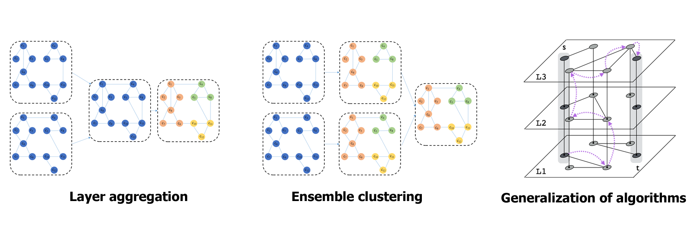
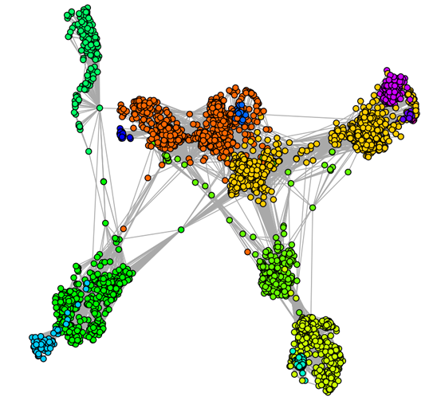
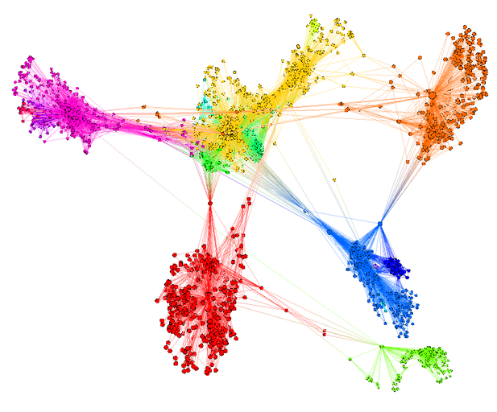
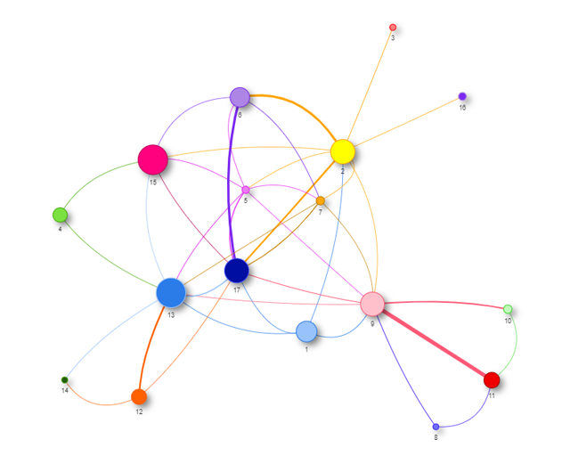
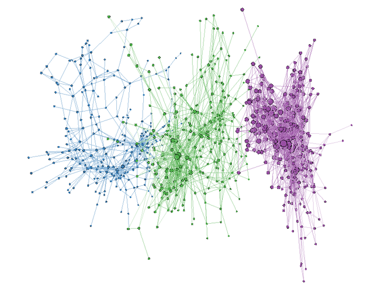

<h1> CDITools v1.0</h1>

CDITools is an extensible and easy to use tool that allows to go through the main stages of complex network processing: analysis, detection, visualization and evaluation of communities, regardless of the topology.

### Functionalities:

 - Upload the network
 - Select topology
 - Preprocess the network
 - Calculate measures of centrality
 - Detect communities
 - Visualize networks with community detection
 - Evaluate detected communities
 - Calculate similarity between communities

CDITools supports the following approaches for the detection of communities in multiplex networks:

### Requirements and Installation

Download and install a classical copy of R from:

[http://www.r-project.org/](http://www.r-project.org/)

Some external packages are required within the R environment. However, the main script should be able to detect the missing packages and install them, automatically. Therefore, it is likely that you _do not_ need to install them by yourself.

Download and install a copy of RStudio from:

[https://www.rstudio.com/](https://www.rstudio.com/)

RStudio, besides being a development environment, has fundamental components that allow the correct operation of the CDITools application. How: _pandoc_

### Installing

Finally, if your system has a working installation of R and RStudio, you can download the last version of CDITools and unzip it. Open the RStudio environment and move to the unzipped folder path, by typing:

    setwd("CDITools_PATH")

CDITools\_PATH is the path where the CDITools application is located. Example: setwd(‘C:/Users/Bill/Desktop/CDITools’)

Once in the directory, just run the application, typing:

    source("CDIToolsGUI.R")

This should be enough. The script will check for the required packages and will try to automatically install the missing ones. The whole process might take a few minutes, the first time you run CDITools.

### Usage

CDITools has several networks both as monoplex and multiplex, compressed and with a _.zip_ extension in the folder _/data_. These compressed networks are the input for the application works.

The user can take these networks as a reference to create their own.

### Gallery

Here there are a few networks rendered by CDITools:

 
 

### Authors

 - Orestes Javier Pérez Cruz
 - Giselle Rodríguez Delgado
 - Arian Mariano Pina

